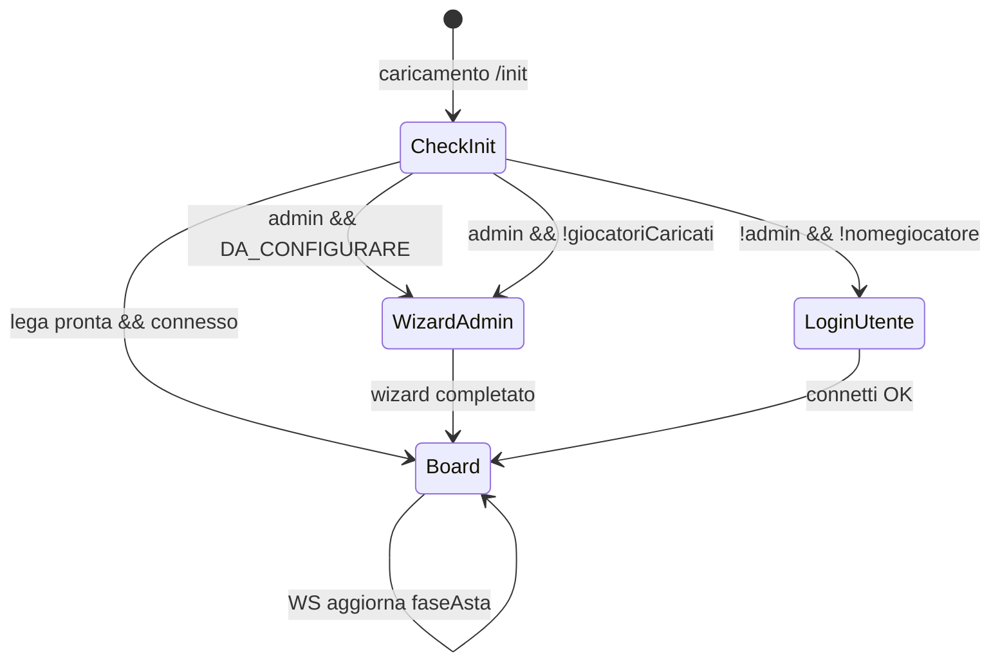

# Piano S14 — UI/UX FantaAsta (definitivo per implementazione)

> **Ultimo aggiornamento:** 2026-09-28 — mobile landscape = layout PC + scroll soft (ui167)  
> **Stato:** Implementazione in corso (desktop consolidato; portrait + landscape)  
> **Branch:** `asta27`  
> **Vincolo:** nessuna sicurezza reale; **salvare** logica WS, API e regole asta esistenti  
> **Vincolo UI (attivo):** portrait = tab; landscape = vista PC scrollabile; **non rompere il layout PC** (≥900px)

---

## 0. Sintesi esecutiva

S14 trasforma FantaAsta da **multi-pagina con tab browser** a **single-page app** nello spirito di [FantaAsta Live](https://fanta-asta-live.fantacalcio.it), con identità visiva **originale**. Si cambia solo presentazione e flussi UX; `app.js`, `ws-connection.js` e backend restano la fonte di verità.

**Chiarimento F1 (scope):** nel repo esistono due app separate:
- **FantaAsta** (`/fantaasta/`) — asta live → **questo è S14**
- **FantaLive** (`/fantalive/`) — punteggi partita in tempo reale → **fuori scope S14**

---

## 1. Decisioni prese (brainstorming 2026-09-25)

| ID | Domanda | Decisione |
|----|---------|-----------|
| D5 | Layout | **Single-page** integrata, no schede `target="_blank"` |
| A1 | Desktop squadre | **Fascia orizzontale in basso** (scroll), come screenshot riferimento; sostituisce `riepilogo.html` |
| A1b | Desktop asta | **Centro-alto:** giocatore in asta, timer, rilanci, conferma |
| A1c | Desktop giocatori | **Sidebar destra:** ricerca, filtri, lista liberi, avvio asta |
| A2 | Mobile nav | **Tab bar fissa**; asta attiva **evidenziata** (badge/pulse) |
| A3 | Lista giocatori desktop | Sidebar con filtro liberi, ruolo, squadra SA, ordinamento |
| A3b | Mobile tab | `Asta` \| `Squadre` \| `Giocatori` \| `Operazioni` |
| A4 | Admin setup | **Carosello step** al primo accesso; obbligo upload giocatori |
| A4b | Lega incompleta | Al prossimo accesso **riparte** il wizard |
| A4c | Utenti normali | **Schermata login fake:** nome squadra (es. GIOC1 modificabile) |
| B | Identità visiva | **A carico del design system** — originale, non copia Fantacalcio |
| C1 | Dati squadra | Tutto ciò che c’è oggi: acquisti (ruolo/nome/prezzo), somme, residui, max rilancio |
| C2 | Log/offerte desktop | Sezione navigabile dedicata (tab Log \| Offerte) |
| C2b | Log mobile | Tab **Operazioni** |
| C3 | Mia squadra | **Evidenziata** (bordo/glow), **stesso ordine e dimensione** delle altre |
| D1 | Wizard admin | Carosello se lega non esiste |
| D2 | Login utente | Schermata ingresso con nome modificabile |
| D3 | Classic + Mantra | **Entrambi** — nessuna funzionalità rimossa |
| D4 | Admin in toolbar | Avatar + nome; admin → riapre carosello impostazioni |
| E1 | Animazioni | **Medio** — utili (timer, aggiudicazione), non decorative |
| E2 | Suoni | **Predisposizione** (hook/CSS class), implementazione futura |
| F | Priorità | Ordine sotto, con **E2E sempre verdi** |

---

## 2. Riferimento UX vs nostro prodotto

### Cosa prendiamo dal screenshot FantaAsta Live

```
┌──────────────────────────────────────────────────────────────────────────┐
│ TOOLBAR: menu | pausa | logo | LIVE | utenti disconnessi | avatar      │
├───────────────────────────────┬──────────────────────────────────────────┤
│                               │  LISTA GIOCATORI (sidebar)               │
│  GIOCATORE IN ASTA            │  [Cerca...]                              │
│  foto/card + ruolo + FVM      │  filtri: ruolo | squadra SA | ordinamento│
│                               │  ─────────────────────────               │
│  BASE | OFFERTA VELOCE +5 +10 │  Kane      Bayern    499                 │
│  OFFERTA MANUALE [Offri]      │  Haaland   Man City  415                 │
│  TIMER ████████░░             │  ...                                     │
│  [Conferma] [Annulla] admin   │  [Metti all'asta] (se turno/admin)       │
├───────────────────────────────┴──────────────────────────────────────────┤
│  SQUADRA1 │ SQUADRA2 │ SQUADRA3 │ ... │ SQUADRA10 │  → scroll orizzontale │
│  budget   │ budget   │ budget   │     │ budget    │                       │
│  P D C A  │ acquisti │ ...      │     │           │                       │
└──────────────────────────────────────────────────────────────────────────┘
```

### Cosa facciamo diverso (originalità)

| Elemento | FantaAsta Live | FantaAsta nostra |
|---------|----------------|------------------|
| Palette | Viola `#2229A1` + verde `#00FFB3` | **“Notte di gara”** — vedi §5 |
| Background | Foto stadio | Texture noise + gradiente scuro (no stock) |
| Card squadre | Icone generiche globo/trofeo | **Colore squadra** assegnato + iniziali |
| Tipografia | Inter | **Plus Jakarta Sans** + **Space Grotesk** (numeri) |
| Angoli | Molto arrotondati (60px) | Raggi medi (12–16px), più “tool premium” |
| Tab sidebar | Lista \| Assegnazioni | Lista liberi \| (opz.) preferiti |

---

## 3. Architettura tecnica (vincolo: codice esistente)

### Principio: “UI adapter”, non rewrite

```
┌─────────────────────────────────────────────────┐
│  NUOVO: index.html + partials + design-system.css │
│  NUOVO: direttive/componenti presentazione      │
├─────────────────────────────────────────────────┤
│  INVARIATO: app.js (logica asta, $rootScope)      │
│  INVARIATO: ws-connection.js                      │
│  INVARIATO: API REST + WS operazioni               │
└─────────────────────────────────────────────────┘
```

### Strategia: Opzione B — Single-page AngularJS

1. **Un solo `index.html`** con layout a zone (`ng-include` per partial)
2. **Viste mobile** = stesso DOM, `ng-show` per tab attiva (non nuove pagine)
3. **`admin.html`** → logica resta, UI migrata in carosello impostazioni
4. **Pagine satellite** → redirect a `index.html#tab=...` per compatibilità link vecchi
5. **`app.js`** — refactor **minimo**:
   - Estrarre solo template HTML in file separati
   - Aggiungere `$rootScope.uiTab`, `$rootScope.wizardStep` per navigazione UI
   - **Non** modificare `inviaOfferta`, `conferma`, `getMessaggio`, ecc. salvo binding UI

### Stack grafico scelto

| Tool | Scelta | Motivo |
|------|--------|--------|
| CSS | **Design system custom** (`fantaasta-ui.css` + token CSS) | Zero build obbligatorio; AngularJS 1.6 compatibile |
| PostCSS/Tailwind | Opzionale in S14.1+ | Solo se serve velocità utility; non bloccante |
| Icone | **Lucide** (SVG sprite) | Coerenti, leggere, no FA 4 |
| Font | Google Fonts: Plus Jakarta Sans, Space Grotesk | Distinti da Inter-overused |
| Animazioni | **CSS** + `angular-animate` | Medio livello; `prefers-reduced-motion` |
| Componenti | Direttive Angular `fa-*` | Wrapper su markup esistente |
| Toast | UI Bootstrap toast (già presente) o custom leggero | Feedback aggiudicazione |
| Suoni | `data-sound` + stub `SoundService` vuoto | Futuro |

### Cosa NON introdurre

- React, Vue, migrazione framework
- Nuovo state manager
- Auth reale, JWT, CSRF
- Modifiche regole asta lato server

---

## 4. Identità visiva — “Notte di gara” (proposta originale)

> Mood: **elegante, sportivo, notturno** — come guardare un match su un tablet in salotto, non come landing corporate.

### Palette

| Token | Valore | Uso |
|-------|--------|-----|
| `--bg-deep` | `#0C1018` | Sfondo app |
| `--bg-surface` | `#151B26` | Card, pannelli |
| `--bg-elevated` | `#1E2736` | Hover, input |
| `--border-subtle` | `rgba(255,255,255,0.08)` | Separatori |
| `--accent-primary` | `#E8A838` | CTA, LIVE, timer attivo — **ambra da floodlight** |
| `--accent-secondary` | `#3ECFB2` | Successo, budget ok, connesso |
| `--accent-focus` | `#7B9CFF` | Focus, link, filtro attivo |
| `--danger` | `#F07167` | Tempo scaduto, azioni distruttive |
| `--text-primary` | `#F0F2F5` | Testo principale |
| `--text-muted` | `#8B95A8` | Secondario |
| `--role-p` | `#D4A017` | Portiere |
| `--role-d` | `#4DA3FF` | Difensore |
| `--role-c` | `#3ECFB2` | Centrocampista |
| `--role-a` | `#F07167` | Attaccante |

**Perché non viola/verde:** è la combo Fantacalcio; ambra + teal + slate è riconoscibile e calda senza essere un clone.

### Tipografia

- **Body:** Plus Jakarta Sans 400/500/600
- **Numeri, prezzi, timer:** Space Grotesk 600/700 + `font-variant-numeric: tabular-nums`
- **Logo/nome lega:** Space Grotesk uppercase tracking

### Superfici e profondità

- Card con `border: 1px solid var(--border-subtle)` + `box-shadow: 0 4px 24px rgba(0,0,0,0.35)`
- Background: gradiente radiale sottile `#1a2233 → #0c1018` + noise SVG 2% opacità (no foto)
- Mia squadra evidenziata: `box-shadow: 0 0 0 2px var(--accent-primary)` + pallino ambra

### Riferimenti ispirazione (non copia)

- Densità dati + dark elegante: stile dashboard sport analytics
- Micro-interazioni utili: app fintech dark (timer, stati)
- Tab bar mobile: pattern iOS moderno con label brevi

---

## 5. Mappa schermate e stati app

### Macchina a stati UI (sopra la logica esistente)



### 5.1 Wizard admin (carosello)

**Trigger:** `data.DA_CONFIGURARE` OR `calciatori.length === 0` OR flag config incompleta  
**Non skippabile** fino a upload file giocatori.

| Step | Titolo | Campi / azioni | API esistente |
|------|--------|----------------|---------------|
| 1 | Benvenuto | Nome lega (opz.), n° utenti | `numeroUtenti` |
| 2 | Regole | Budget, secondi asta, turni, single admin | `budget`, `durataAstaDefault`, `isATurni`, `isSingle` |
| 3 | Rosa | Min/max per ruolo; toggle Mantra | `minP`…`maxA`, `isMantra` |
| 4 | Partecipanti | Preview GIOC0…GIOCn (placeholder) | `inizializzaLega` |
| 5 | Quotazioni | **Upload .xls obbligatorio** + Mantra .txt se serve | `caricaFile` |
| 6 | Riepilogo | Riepilogo + “Avvia lega” | `confermaConfigIniziale` / `aggiornaConfigLega` |

UI: step indicator orizzontale (desktop) / “3 di 6” (mobile); pulsanti Indietro/Avanti sticky in basso.

**Re-entry:** se mancano giocatori o config, al reload → wizard dallo step mancante.

### 5.2 Login utente (fake)

**Trigger:** lega configurata, utente non connesso (`!nomegiocatore`)

- Lista slot squadra in ordine (`elencoAllenatori | orderBy:'ordine'`)
- Slot libero: campo nome precompilato (`GIOC1`…) **modificabile**
- Slot occupato: disabilitato o “già connesso”
- Password se configurata → modale esistente (`ModalDemoCtrl`)
- Submit → `callDoConnect` / WS `connetti` (invariato)

### 5.3 Board principale (desktop)

Tre zone fisse + toolbar + fascia squadre.

**Toolbar**
- Sinistra: menu (drawer: link utili, help, changelog)
- Centro: nome lega + pillola stato (`IDLE` / `LIVE` / `PAUSA` / `CONFERMA`)
- Destra: avatar + nome squadra; se admin → tap apre carosello impostazioni; indicatore WS

**Zona A — Asta (centro-sinistra, ~55% larghezza)**
- Stato `IDLE`: messaggio + invito a selezionare giocatore dalla sidebar
- Stato `BIDDING`: `fa-auction-stage` — card giocatore, prezzo, vincitore, barra timer animata, +1/+5/+10, offerta manuale, auto-allinea
- Stato `DA_CONFERMARE`: overlay conferma/annulla (admin)
- Admin: sezione “Opera come” in drawer collassabile (non invasiva)

**Zona B — Giocatori (sidebar destra, ~45%)**
- Search con debounce su `filterNome`
- Chip ruolo (P/D/C/A o Mantra macro-ruoli)
- Dropdown/filter squadra Serie A
- Toggle “Solo liberi” (default ON)
- Ordinamento: quotazione, nome, ruolo
- Lista: `calciatori | myTableFilter | orderBy`
- Riga selezionata → highlight; pulsante “Metti all’asta” se `puoAvviareAsta` / turno
- Giocatore assegnato: riga desaturata + badge squadra acquirente

**Zona C — Squadre (fascia bassa, full width)**
- Scroll orizzontale card `fa-team-strip-card`
- Per squadra (dati da `getFromMapSpesoTotale`, mappe esistenti):
  - Nome, colore, stato connessione
  - Budget: speso / residuo / max
  - Contatori ruolo (P D C A o Mantra)
  - **Lista acquisti:** ruolo badge + nome + prezzo (scroll interno se lunga)
- Mia squadra: bordo ambra, non riordinata

**Zona D — Log / Offerte (desktop, pannello collassabile o tab sotto asta)**
- Tab `Log` → contenuto da `logger.html` / `aggiornaLoggerMessaggi`
- Tab `Offerte` → cronologia da `cronologiaOfferte.html`
- Solo lettura per utenti; admin può azioni esistenti (es. cancella offerta)

### 5.4 Mobile — tab bar

| Tab | Icona | Contenuto |
|-----|-------|-----------|
| **Asta** | Gavel | Auction stage + rilanci (pollice in basso); badge **LIVE** se `BIDDING` |
| **Squadre** | Users | Fascia squadre verticale / lista espandibile; tap → dettaglio rosa full |
| **Giocatori** | List | Sidebar lista liberi + avvio asta |
| **Operazioni** | Activity | Log + cronologia offerte |

**Toolbar mobile (sopra tab bar):** connessione, nome squadra, avatar admin.

**Asta attiva:** tab Asta con badge pulsante + auto-focus opzionale al passaggio a `BIDDING`.

### 5.5 Carosello impostazioni admin (post-creazione)

Stessi step del wizard, **modificabili**; accesso da avatar admin in toolbar. Include:
- Gestione utenti (da `admin.html`)
- Upload/re-upload quotazioni
- Pausa/riprendi, disconnect all, azzera (con confirm)
- Sezione “Pericoloso” in rosso

---

## 6. Componenti UI (catalogo)

| Componente | File previsto | Dati `$rootScope` / funzioni esistenti |
|------------|---------------|--------------------------------------|
| `fa-toolbar` | `partials/toolbar.html` | `nomegiocatore`, `isAdmin`, `faseAsta`, WS status |
| `fa-auction-stage` | `partials/auction-stage.html` | `offertaVincente`, `faseAsta`, `inviaOffertaLibera`, `trackProgressBar` |
| `fa-player-search` | `partials/player-search.html` | `calciatori`, filtri, `selezionaCalciatore`, `inizia` |
| `fa-team-strip` | `partials/team-strip.html` | `elencoAllenatori`, `getFromMapSpesoTotale`, mappe spesa |
| `fa-team-card` | direttiva | singolo allenatore + acquisti |
| `fa-role-badge` | direttiva | ruolo / macro Mantra |
| `fa-wizard` | `partials/wizard/*.html` | `config`, `confermaConfigIniziale`, upload |
| `fa-login-screen` | `partials/login-screen.html` | `callDoConnect`, `elencoAllenatori` |
| `fa-mobile-tabs` | `partials/mobile-tabs.html` | `uiTab` |
| `fa-ops-panel` | `partials/ops-panel.html` | log + cronologia |
| `fa-toast` | servizio leggero | eventi WS aggiudicazione |
| `fa-timer-bar` | direttiva | `contaTempo`, `durataAsta` — animazione colore |

---

## 7. Mapping funzionalità vecchio → nuovo

| Funzione attuale | Dove vive oggi | Dove vive dopo S14 |
|------------------|----------------|-------------------|
| Config iniziale lega | `index.html` blocco config | Wizard step 1–4 |
| Upload quotazioni | `admin.html` | Wizard step 5 + impostazioni |
| Connessione allenatore | Tabella Allenatori + icone | Login screen + toolbar |
| Lista liberi + filtri | `index` + `liberi.html` | Sidebar / tab Giocatori |
| Avvio asta | Icona start | Pulsante “Metti all’asta” |
| Rilanci +1/+5/+10 | Sezione Offerte | Auction stage |
| Opera come | Sezione collassabile | Drawer admin in asta |
| Riepilogo rose | `riepilogo.html` | Fascia squadre bassa |
| Cronologia | `cronologiaOfferte.html` | Tab Operazioni / desktop Log\|Offerte |
| Log messaggi | `logger.html` | Tab Operazioni / desktop |
| Admin utenti | `admin.html` | Carosello impostazioni |
| Pausa / resume / termina | Toolbar implicita | Toolbar + menu |
| Classic / Mantra | Flag `isMantra` | Invariato, UI adattiva chip/colonne |
| Gestione turni | `haIlTurno`, `nomeGiocatoreTurno` | Indicatori su card squadra + messaggi asta |

---

## 8. Responsive

| Breakpoint | Layout |
|------------|--------|
| `< 768px` | Tab bar, asta full-width, squadre in tab dedicata |
| `768–1024px` | Sidebar giocatori ridotta o drawer; squadre 2 righe |
| `> 1024px` | Layout completo 3 zone + fascia squadre |
| `> 1440px` | Più spazio lista acquisti nelle card squadra |

Requisiti:
- `viewport` meta su tutte le pagine
- Touch min 44×44px
- `safe-area-inset` su tab bar e toolbar
- `prefers-reduced-motion`: timer solo colore, no pulse
- Tabelle → card su mobile (già previsto per acquisti in squadra)

---

## 9. Animazioni (livello medio)

| Evento | Animazione | Implementazione |
|--------|------------|-----------------|
| Timer asta | Barra che si consuma; ultimi 3s rosso + pulse leggero | CSS `@keyframes` su `fa-timer-bar` |
| Nuovo rilancio | Flash breve sul prezzo | `angular-animate` class |
| Aggiudicazione | Card giocatore → slide verso card squadra + toast | CSS transition 400ms |
| Cambio tab mobile | Fade/slide 200ms | `ng-animate` |
| LIVE badge | Pulse opaco 2s loop | CSS, disabilitato con reduced-motion |
| Count-up prezzo | Opzionale leggero | JS requestAnimationFrame su `offertaVincente.offerta` |
| Suoni | — | Stub `SoundService.play('bid')` no-op |

---

## 10. Piano implementazione (ordine consigliato)

> Ogni fase termina con `./scripts/run-s6-tests.sh` verde.

| Fase | Deliverable | Rischio | Note |
|------|-------------|---------|------|
| **S14.0** | Token CSS, font, Lucide, 4 componenti base (role-badge, team-card, timer-bar, status-pill) | Basso | Pagina statica demo `ui-preview.html` opzionale |
| **S14.1** | Shell `index.html` nuovo layout vuoto; mobile tab bar; toolbar | Basso | Vecchio layout nascosto con flag `?legacy=1` temporaneo |
| **S14.2** | Wizard admin carosello (step 1–6) collegato ad API esistenti | Medio | Sostituisce blocco `config` |
| **S14.3** | Login screen utente | Basso | Prima del board |
| **S14.4** | Fascia squadre (team strip) con acquisti e budget | Medio | Cuore richiesta “vedere tutti” |
| **S14.5** | Sidebar ricerca giocatori + avvio asta | Medio | Sostituisce liberi + sezione selezione |
| **S14.6** | Auction stage (rilanci, timer, conferma) | Alto | Cuore asta; massima attenzione E2E |
| **S14.7** | Pannello Log/Offerte desktop + tab Operazioni mobile | Basso | Assorbe 2 pagine |
| **S14.8** | Carosello impostazioni admin + migrazione `admin.html` | Medio | Redirect `admin.html` → `index.html?settings=1` |
| **S14.9** | Redirect pagine satellite, rimozione link `target="_blank"`, cleanup CSS Bootstrap | Basso | |
| **S14.10** | Rifinitura: empty states, a11y, animazioni, documentazione | Basso | Aggiorna roadmap |

### Perché questo ordine

1. **Design system prima** — evita rework
2. **Wizard prima del board** — flusso admin è entry point
3. **Team strip prima dell’asta** — valore visivo immediato, dati già in `$rootScope`
4. **Asta dopo lista giocatori** — dipendenze UX (selezioni → bid)
5. **Admin/settings per ultimo** — funziona già su `admin.html` come fallback

---

## 11. Criteri di accettazione S14

- [ ] Zero tab browser per flussi principali (liberi, riepilogo, offerte, log integrati)
- [ ] Admin completa setup solo con wizard; upload file obbligatorio
- [ ] Utente sceglie/modifica nome squadra al login
- [ ] Desktop: asta + ricerca + fascia squadre visibili insieme (come riferimento)
- [ ] Mobile: 4 tab; asta LIVE evidenziata
- [ ] Classic e Mantra funzionano come prima
- [ ] Mia squadra evidenziata senza cambiare ordine
- [ ] `./scripts/run-s6-tests.sh` passa (14 Java + 8 Playwright)
- [ ] Nessuna nuova dipendenza di sicurezza
- [ ] Identità visiva distinta da FantaAsta Live (no viola/verde clone)

---

## 12. Rischi e mitigazioni

| Rischio | Mitigazione |
|---------|-------------|
| Rompere E2E che usano selettori DOM vecchi | Aggiornare `asta-helpers.js` a step; mantenere `data-testid` su elementi critici |
| `app.js` troppo monolitico | Solo estrazione template; no split logica in S14 |
| Layout desktop affollato con 10 squadre | Scroll orizzontale + expand card su click |
| Mantra UI diversa da Classic | Test E2E separato o flag in test esistente |
| Immagini giocatori assenti nel repo | Avatar con iniziali + colore ruolo (come proposto design system) |

---

## 13. File previsti (nuovi/modificati)

```
src/main/webapp/fantaasta/
├── index.html              # REWRITE layout shell
├── fantaasta-ui.css        # NEW design system
├── partials/
│   ├── toolbar.html
│   ├── auction-stage.html
│   ├── player-search.html
│   ├── team-strip.html
│   ├── mobile-tabs.html
│   ├── ops-panel.html
│   ├── login-screen.html
│   └── wizard/
│       ├── step-welcome.html
│       ├── step-rules.html
│       ├── step-roster.html
│       ├── step-players.html
│       ├── step-upload.html
│       └── step-summary.html
├── directives/
│   └── fa-ui.js            # NEW direttive presentazione (opzionale)
├── admin.html              # REDIRECT → index?settings=1
├── liberi.html             # REDIRECT
├── riepilogo.html          # REDIRECT
├── cronologiaOfferte.html  # REDIRECT
├── logger.html             # REDIRECT
├── app.js                  # MINIMO: uiTab, wizardStep, templateUrl
├── ws-connection.js        # INVARIATO
└── stile.css               # DEPRECATO gradualmente → fantaasta-ui.css
```

---

## 14. Decisioni tabella finale

| # | Stato |
|---|-------|
| D1 Scope FantaAsta only | ✅ |
| D2 Single-page AngularJS | ✅ |
| D3–D4 Visual identity | ✅ “Notte di gara” §4 |
| D5 Layout integrato | ✅ |
| D6 Satellite deprecate | ✅ con redirect |
| D7 Classic + Mantra | ✅ |
| D8 Animazioni medio | ✅ |
| D9 Riferimento FantaAsta Live | ✅ solo UX layout |
| D10 Ordine implementazione | ✅ §10 |

---

## 15. Documenti correlati

- [roadmap-sistemazione.md](./roadmap-sistemazione.md)
- [promptClaude.md](../promptClaude.md)
- [test-scenari.md](./socket/test-scenari.md)
- E2E: `tests/e2e/asta-browser-flow.spec.js`, `tests/e2e/helpers/asta-helpers.js`
- Screenshot riferimento: layout FantaAsta Live (allegato sessione)
